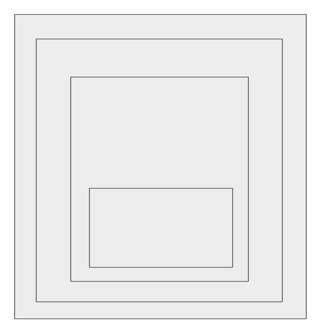
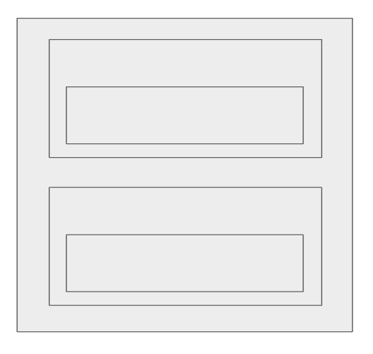

export { default as theme } from './theme'
import { LiveCode } from "mdx-deck-live-code";
import { Head } from "mdx-deck";
import { previewStyle, editorStyle } from "./styles";

<Head>
    <title> WHY React </title>
</Head>

# Why React ?

## Why React Hooks ??

### wait... why am I here ??? 

  

#### By `/^(Ry|Bri)an$/gm`

---

# React Highlights

  

* vDOM
* Flux (one way data flow)
* Component Composition/Reuse

* `<JSX />`...

---
# next =>

## Class or Functional

---

<LiveCode
    title="Class component"
    code={require("!raw-loader!./code/component.js")}
    previewProps={previewStyle}
    editorProps={editorStyle}
/>

---

<LiveCode
    size="small"
    title="Functional/ Stateless Components"
    code={require("!raw-loader!./code/function.js")}
    previewProps={previewStyle}
    editorProps={editorStyle}
/>
---

## Class Comp.

* Access to states/ [lifecyle methods](http://projects.wojtekmaj.pl/react-lifecycle-methods-diagram/)
* ... but it's wordy and not [webpack friendly](https://itnext.io/react-component-class-vs-stateless-component-e3797c7d23ab)

## Functional
* Only stateless controls,  `props` to `JSX`

---

# ... Functional
# Stateless ???

---
<LiveCode
    title="What if... Don't look at the code yet lol"
    code={require("!raw-loader!./code/function_hook.js")}
    previewProps={previewStyle}
    editorProps={editorStyle}
/>

---

## Wait a second...
### ... we've more `<code/>`

---

import { CodeSurfer } from "mdx-deck-code-surfer"

<CodeSurfer
  title="You'll see these a lot..."
  code={require("!raw-loader!./code/hoc.js")}
  lang="javascript"
  showNumbers={true}
  dark={false}
  steps={[
    { notes: ""},
    { range: [3, 5], notes: "You need these to support browser routing" },
    { range: [7, 9], notes: "Here is our redux" },
    { range: [11, 13], notes: "You can also add more styles" },
    { range: [16, 18], notes: "Let's add them all" },
    { range: [20, 25], notes: "btw, there is better way of doing this" },
  ]}
/>

---
## HoC

---
## renderProps

---

<CodeSurfer
  title="renderProps (cont.)"
  code={require("!raw-loader!./code/carousel_props.js")}
  lang="javascript"
  showNumbers={true}
  dark={false}
  steps={[
    { notes: ""},
    { lines: [2], notes: "Custom paging dots" },
    { range: [3, 10], notes: "Custom left round button" },
    { range: [11, 18], notes: "Custom right round button" },
  ]}
/>

---

## Wrapper Hell

[Solution lol](https://github.com/facebook/react-devtools/pull/503)

---

...but there is hope...

---

### useState
### useEffect
### useContext
### useReducer
...
## useYourOwn
---

Questions?

---

<CodeSurfer
  title="Remember this?"
  code={require("!raw-loader!./code/component.js")}
  lang="javascript"
  showNumbers={false}
  dark={false}
  steps={[
    { notes: ""},
  ]}
/>

---

<CodeSurfer
  title="Basic State Hook"
  code={require("!raw-loader!./code/useState.js")}
  lang="javascript"
  showNumbers={false}
  dark={false}
  steps={[
    { notes: ""},
    { range: [5, 5], notes: "declare state" },
    { range: [8, 11], notes: "Simple render" },
  ]}
/>

---
<CodeSurfer
  title="The React Way"
  code={require("!raw-loader!./code/useEffect.js")}
  lang="javascript"
  showNumbers={false}
  dark={false}
  steps={[
    { notes: ""},
    { range: [2, 5], notes: "Setting initial state and binding function" },
    { range: [8, 11], notes: "Running at the start" },
    { range: [15, 18], notes: "Running at the end" },
    { range: [22, 23], notes: "Running every subsequent update" },
    { range: [26, 28], notes: "Function to change state" },
    { range: [1, 36], notes: "" },
  ]}
/>
---
<CodeSurfer
  title="The Hooks Way"
  code={require("!raw-loader!./code/useEffect2.js")}
  lang="javascript"
  showNumbers={false}
  dark={false}
  steps={[
    { range: [2, 2], notes: "Setting initial useState" },
    { range: [4, 5], notes: "setting function to change state" },
    { range: [8, 13], notes: "useEffect (lifecycle) for entire ChatAPI" },
    { range: [16, 19], notes: "Running every subsequent update" },
    { range: [1, 19], notes: "Much cleaner, Much shorter" },
  ]}
/>
---
## Basic Rules

---

<CodeSurfer
  title="React Context"
  code={require("!raw-loader!./code/useContext.js")}
  lang="javascript"
  showNumbers={false}
  dark={false}
  steps={[
    { range: [9, 17], notes: "Basic Context Setup" },
  ]}
/>

---
<CodeSurfer
  title="React Hooks Context"
  code={require("!raw-loader!./code/useContext2.js")}
  lang="javascript"
  showNumbers={false}
  dark={false}
  steps={[
    { range: [3, 9], notes: "Setup Context" },
    { range: [10, 12], notes: "use Context" },
  ]}
/>
---
<CodeSurfer
  title="React Custom Hooks"
  code={require("!raw-loader!./code/useCustomHook.js")}
  lang="javascript"
  showNumbers={false}
  dark={false}
  steps={[
    { range: [1, 15], notes: "ChatAPI Example" },
  ]}
/>
---

## Usage

---

## Thank You! Any Questions?