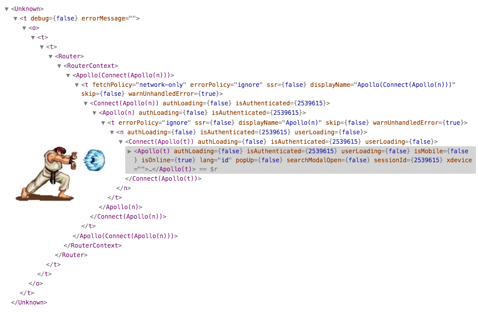

import { themes } from "mdx-deck";
export const theme = themes.default;
import { LiveCode } from "mdx-deck-live-code";
import { Head } from "mdx-deck";
import { Box, Heading, Text } from "rebass";
import { previewStyle, editorStyle } from "./styles";

<Head>
  <title> WHY React </title>
</Head>

# React ?

## Components??

### Lifecycle methods???

### Hooks????

  

---

# React Highlights

  

- Virtual DOM
- Component Composition/Reuse
- Hooks
- Lifecycle methods

---

## What is a Component

### Components === State Machines

<Text fontSize={[3, 4, 4]} color="primary">
  React thinks of UIs as simple state machines. By thinking of a UI as being in
  various states and rendering those states, it's easy to keep your UI
  consistent. In React, you simply update a component's state, and then render a
  new UI based on this new state. React takes care of updating the DOM for you
  in the most efficient way
</Text>

### Components === Functions

<Text 
fontSize={[ 5, 5, 5 ]}
color='primary'>
Just like functions take parameters and return a result,
components take in values and return UI output. 
Given the same input values, a component will return the same UI output.
Often described as UI = f(state)</Text>
---
## Class or Function Components

---

import { CodeSurfer } from "mdx-deck-code-surfer";

<CodeSurfer
  title="Declaring Components-- Class VS Function"
  code={require("!raw-loader!./code/compare_Class_Function.js")}
  lang="javascript"
  showNumbers={true}
  dark={false}
  steps={[
    { notes: "" },
    { range: [3, 3], notes: "Syntax for Class Component" },
    { range: [4, 4], notes: "The render method is required for all components" },
    { range: [5, 8], notes: "Rendering returns a tree of React component descriptions, which will eventually be turned into HTML" },
    { range: [12, 15], notes: "The ReactDOM.render method creates a new component tree, initializes the React library, and appends the output from the component and its children to the given HTML element"},
    { range: [17, 23], notes: "Functional Component"},
    { notes: "" }
]}
/>
---
<LiveCode
  title="Class component -- Internal Data with State"
  code={require("!raw-loader!./code/component.js")}
  previewProps={previewStyle}
  editorProps={editorStyle}
/>

---

<CodeSurfer
  title="Using Component State"
  code={require("!raw-loader!./code/component.js")}
  lang="javascript"
  showNumbers={true}
  dark={false}
  steps={[
    { notes: "" },
    { range: [2, 6], notes: "For ES6 class components, initial state is defined in the constructor, or assigned directly using the Class Properties syntax." },
    { range: [8, 12], notes: "State is updated by calling this.setState({someField : someValue}). You should not  modify the state object directly, as React will not know it was changed" },
    { range: [9, 10], notes: "Every call to setState triggers a re-render" },
    { range: [18, 21], notes: "the state object is available as this.state, and can be read from directly"},
    { notes: "" }
  ]}
/>
---
<LiveCode
    title="Functional/ Stateless Components"
    code={require("!raw-loader!./code/function.js")}
    previewProps={previewStyle}
    editorProps={editorStyle}
/>
---

<CodeSurfer
  title="One way data flow -- passing data as props"
  code={require("!raw-loader!./code/function_reuse.js")}
  lang="javascript"
  showNumbers={true}
  dark={false}
  steps={[
    { notes: "" },
    { range: [1, 3], notes: "The child component" },
    { range: [5, 12], notes: "The Parent component" },
    { range: [7, 12], notes: "passing data as props to the child component" },
    { range: [2, 2], notes: "Receive data as props and render" },
    { notes: "Remember: Props are Read-Only!!" }
  ]}
/>

---

### Class Comp.

- Access to states/ [lifecyle methods](http://projects.wojtekmaj.pl/react-lifecycle-methods-diagram/)

### Functional
- Simple JavaScript function which returns a React element
- Only stateless controls, `props`
- `Hooks`

### Rules
- All React components must act like `pure functions` with respect to their props.
---
# Lifecycle Methods
---

<LiveCode
  title="Lifecycle Methods"
  code={require("!raw-loader!./code/lifecycles.js")}
  previewProps={previewStyle}
  editorProps={editorStyle}
/>
---
# ... Functional

# Stateless ???

---

<LiveCode
  title="React hooks -- useEffect"
  code={require("!raw-loader!./code/hooks.js")}
  previewProps={previewStyle}
  editorProps={editorStyle}
/>
---
<LiveCode
  title="What if... Don't look at the code yet lol"
  code={require("!raw-loader!./code/function_hook.js")}
  previewProps={previewStyle}
  editorProps={editorStyle}
/>

---

## Wait a second...

### ... we've more `<code/>`

---

<CodeSurfer
  title="You'll see these a lot..."
  code={require("!raw-loader!./code/hoc.js")}
  lang="javascript"
  showNumbers={true}
  dark={false}
  steps={[
    { notes: "" },
    { range: [3, 5], notes: "You need these to support browser routing" },
    { range: [7, 9], notes: "Here is our redux" },
    { range: [11, 13], notes: "You can also add more styles" },
    { range: [16, 18], notes: "Let's add them all" },
    { range: [20, 25], notes: "btw, there is better way of doing this" }
  ]}
/>

---

<CodeSurfer
  title="renderProps (cont.)"
  code={require("!raw-loader!./code/carousel_props.js")}
  lang="javascript"
  showNumbers={true}
  dark={false}
  steps={[
    { notes: "" },
    { lines: [2], notes: "Custom paging dots" },
    { range: [3, 10], notes: "Custom left round button" },
    { range: [11, 18], notes: "Custom right round button" }
  ]}
/>

---

## Wrapper Hell

[Solution lol](https://github.com/facebook/react-devtools/pull/503)

---

...but there is hope...

---

### useState

### useEffect

### useContext

### useReducer

...

## useYourOwn

---

Questions?

---

<CodeSurfer
  title="Remember this?"
  code={require("!raw-loader!./code/component.js")}
  lang="javascript"
  showNumbers={false}
  dark={false}
  steps={[{ notes: "" }]}
/>

---

<CodeSurfer
  title="Basic State Hook"
  code={require("!raw-loader!./code/useState.js")}
  lang="javascript"
  showNumbers={false}
  dark={false}
  steps={[
    { notes: "" },
    { range: [5, 5], notes: "declare state" },
    { range: [8, 11], notes: "Simple render" }
  ]}
/>

---

<CodeSurfer
  title="The React Way"
  code={require("!raw-loader!./code/useEffect.js")}
  lang="javascript"
  showNumbers={false}
  dark={false}
  steps={[
    { notes: ""},
    { range: [2, 5], notes: "Setting initial state and binding function" },
    { range: [8, 11], notes: "Running at the start" },
    { range: [15, 18], notes: "Running at the end" },
    { range: [22, 23], notes: "Running every subsequent update" },
    { range: [26, 28], notes: "Function to change state" },
    { range: [1, 36], notes: "" },
  ]}
/>
---
<CodeSurfer
  title="The Hooks Way"
  code={require("!raw-loader!./code/useEffect2.js")}
  lang="javascript"
  showNumbers={false}
  dark={false}
  steps={[
    { range: [2, 2], notes: "Setting initial useState" },
    { range: [4, 5], notes: "setting function to change state" },
    { range: [8, 13], notes: "useEffect (lifecycle) for entire ChatAPI" },
    { range: [16, 19], notes: "Running every subsequent update" },
    { range: [1, 19], notes: "Much cleaner, Much shorter" },
  ]}
/>
---
## Basic Rules

---

<CodeSurfer
  title="React Context"
  code={require("!raw-loader!./code/useContext.js")}
  lang="javascript"
  showNumbers={false}
  dark={false}
  steps={[{ range: [9, 17], notes: "Basic Context Setup" }]}
/>

---

<CodeSurfer
  title="React Hooks Context"
  code={require("!raw-loader!./code/useContext2.js")}
  lang="javascript"
  showNumbers={false}
  dark={false}
  steps={[
    { range: [3, 9], notes: "Setup Context" },
    { range: [10, 12], notes: "use Context" },
  ]}
/>
---
<CodeSurfer
  title="React Custom Hooks"
  code={require("!raw-loader!./code/useCustomHook.js")}
  lang="javascript"
  showNumbers={false}
  dark={false}
  steps={[
    { range: [1, 15], notes: "ChatAPI Example" },
  ]}
/>
---

## Usage

## 

## Thank You! Any Questions?
